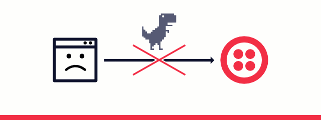
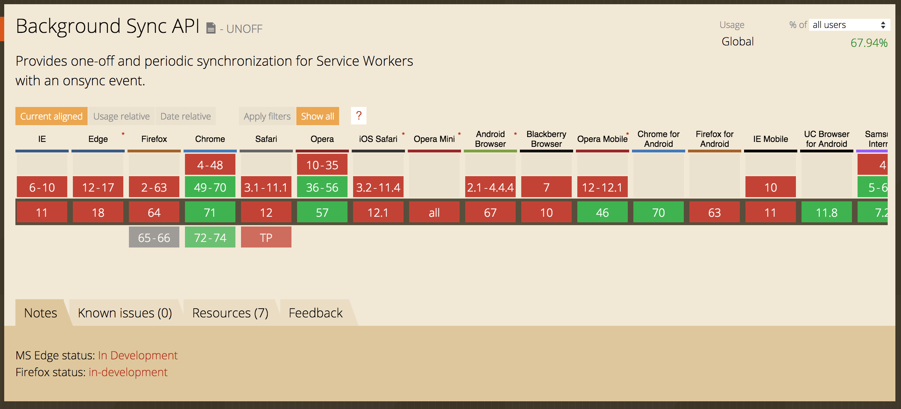
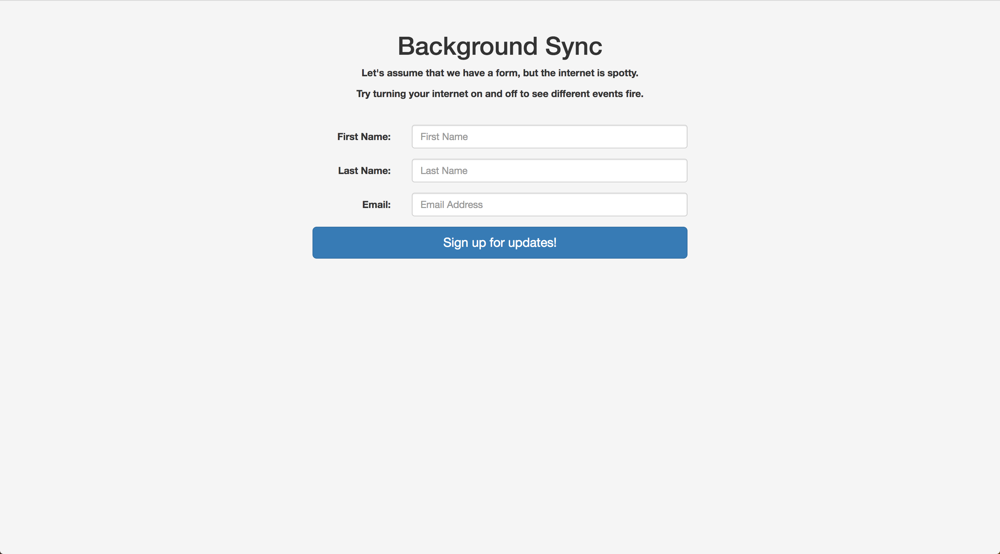

Service workers have been having a moment. In March 2018, iOS Safari began including service workers -- so all major browsers at this point support offline options. And this is more important than ever -- 20% of adults in the United States are without Internet at home, leaving these individuals relying solely on a cellphone to access most information. This can include something as simple as checking a bank balance or something as tedious as searching for a job, or even researching illnesses. 

Offline-supported applications are a necessity, and including a service worker is a great start. However, service workers alone will only get someone part of the way to a truly seamless online-to-offline experience. Caching assets is great, but without an internet connection you still can't access new data or send any requests. 

### The Request Lifecycle

Currently a request might look like this:



A user pushes a button and a request is fired off to a server somewhere. If there is internet, everything should go off without a hitch. If there is not internet ... well things aren't so simple. The request won't be sent, and perhaps the user realizes their request never made it through, or perhaps they are unaware. Fortunately, there's a better way.

Enter: [background sync](https://developers.google.com/web/updates/2015/12/background-sync).

### Background Sync


The lifecycle with background sync is slightly different. First a user makes a request, but instead of the request being attempted immediately, the service worker steps in. The service worker will check if the user has internet access -- if they do, great. The request will be sent. If not, the service worker will wait until the user _does_ have internet and at that point send the request, after it fetches data out of IndexedDB. Best of all, background sync will go ahead and send the request even if the user has navigated away from the original page.



While background sync is fully supported only in Chrome, Firefox and Edge are currently working on implementing it. Fortunately with the use of feature detection and [`onLine` and `offLine` events](https://developer.mozilla.org/en-US/docs/Web/API/NavigatorOnLine/Online_and_offline_events), we can safely use background sync in any application while also including a fallback.



(If you'd like to follow along with the demo, [the code can be found here](https://github.com/carmalou/background-sync-example) and [the demo itself is found here.](https://elastic-feynman-f4d91f.netlify.com/))

Let's assume we have a very simple newsletter signup form. We want the user to be able to signup for our newsletter whether or not they currently have internet access. Let's start with implementing background sync.

(This tutorial assumes you are familiar with service workers. If you are not, [this is a good place to start.](https://carmalou.com/lets-take-this-offline/2017/12/19/lets-take-this-offline-pt3.html) If you're unfamiliar with IndexedDB, [I recommend starting here.](https://carmalou.com/lets-take-this-offline/2018/07/17/lets-take-this-offline-pt4.html))

When you are first setting up a service worker, you'll have to register it from your application's JavaScript file. That might look like this:

```
if(navigator.serviceWorker) {
      navigator.serviceWorker.register('serviceworker.js');
}
```

Notice that we are using feature detection even when registering the service worker. There's almost no downside to using feature detection and it'll stop errors from cropping up in older browsers like Internet Explorer 11 when the service worker isn't available. Overall, it's a good habit to keep up even if it isn't always necessary.

When we set up background sync, our register function changes and may look something like this:

```
if(navigator.serviceWorker) {
        navigator.serviceWorker.register('./serviceworker.js')
        .then(function() {
            return navigator.serviceWorker.ready
        })
        .then(function(registration) {
            document.getElementById('submitForm').addEventListener('click', (event) => {
                registration.sync.register('example-sync')
                .catch(function(err) {
                    return err;
                })
            })
        })
        .catch( /.../ )
    }
```

This is a lot more code, but we'll break it down one line at a time.

First we are registering the service worker like before, but now we're taking advantage of the fact that the [`register`](https://developer.mozilla.org/en-US/docs/Web/API/ServiceWorkerContainer/register) function returns a promise. The next piece you see is [`navigator.serviceWorker.ready`](https://developer.mozilla.org/en-US/docs/Web/API/ServiceWorkerContainer/ready). This is a read-only property of a service worker that essentially just lets you know if the service worker is ready or not. This property provides a way for us to delay execution of the following functions until the service worker is actually ready.

Next we have a reference to the service worker's registration. We'll put an event listener on our submit button, and at that point register a sync event and pass in a string. That string will be used over on the service worker side later on.

Let's re-write this real quick to include feature detection, since we know background sync doesn't yet have wide support.

```
if(navigator.serviceWorker) {
        navigator.serviceWorker.register('./serviceworker.js')
        .then(function() {
            return navigator.serviceWorker.ready
        })
        .then(function(registration) {
            document.getElementById('submitForm').addEventListener('click', (event) => {
                if(registration.sync) {
                    registration.sync.register('example-sync')
                    .catch(function(err) {
                        return err;
                    })
                }
            })
        })
    }
```

Now let's take a look at the service worker side.

```
self.onsync = function(event) {
    if(event.tag == 'example-sync') {
        event.waitUntil(sendToServer());
    }
}
```

We attach a function to [`onsync`](https://developer.mozilla.org/en-US/docs/Web/API/ServiceWorkerGlobalScope/onsync), the event listener for background sync. We want to watch for the string we passed into the register function back in the application's JavaScript. We're watching for that string using `event.tag`.

We're also using [`event.waitUntil`](https://developer.mozilla.org/en-US/docs/Web/API/ExtendableEvent/waitUntil). Because a service worker isn't continually running -- it "wakes up" to do a task and then "goes back to sleep" -- we want to use `event.waitUntil` to keep the service worker active. This function accepts a function parameter. The function we pass in will return a promise, and `event.waitUntil` will keep the service worker "awake" until that function resolves. If we didn't use `event.waitUntil` the request might never make it to the server because the service worker would run the `onsync` function and then immediately go back to sleep.

Looking at the code above, you'll notice we don't have to do anything to check on the status of the user's internet connection or send the request again if the first attempt fails. Background sync is handling all of that for us. Let's take a look at how we access the data in the service worker.

Because a service worker is isolated in its own worker, we won't be able to access any data directly from the DOM. We'll rely on IndexedDB to get the data and then send the data onward to the server.

IndexedDB utilizes callbacks while a service worker is promise-based, so we'll have to account for that in our function. (There are wrappers around IndexedDB that make this process a little simpler. I recommend checking out [IDB](https://github.com/jakearchibald/idb) or [money-clip](https://github.com/HenrikJoreteg/money-clip).)

Here is what our function might look like:

```
return new Promise(function(resolve, reject) {
    var db = indexedDB.open('newsletterSignup');
    db.onsuccess = function(event) {
        this.result.transaction("newsletterObjStore").objectStore("newsletterObjStore").getAll().onsuccess = function(event) {
            resolve(event.target.result);
        }
    }
    db.onerror = function(err) {
        reject(err);
    }
});
```

Walking through it, we're returning a promise, and we'll use the `resolve` and `reject` parameters to make this function more promise-based to keep everything in line with the service worker.

We'll open a database and we'll use the [`getAll`](https://developer.mozilla.org/en-US/docs/Web/API/IDBObjectStore/getAll) method to pull all the data from the specified object store. Once that is success, we'll resolve the function with the data. If we have an error, we'll reject. This keeps our error handling working the same way as all of the other promises and makes sure we have the data before we send it off to the server.

After we get the data, we just make a fetch request the way we normally would.

```
fetch('https://www.mocky.io/v2/5c0452da3300005100d01d1f', {
    method: 'POST',
    body: JSON.stringify(response),
    headers:{
        'Content-Type': 'application/json'
    }
})
```

Of course all of this will only run if the user has Internet access. If the user does not have Internet access, the service worker will wait until the connection has returned. If, once the connection returns, the fetch request fails, the service worker will attempt a maximum of three times before it stops trying to send the request for good.

Now that we've set up background sync, we are ready to set up our fallback for browsers that don't support background sync. Read on for part 2!